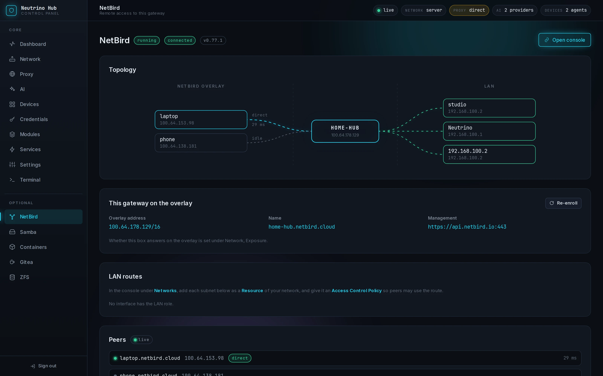
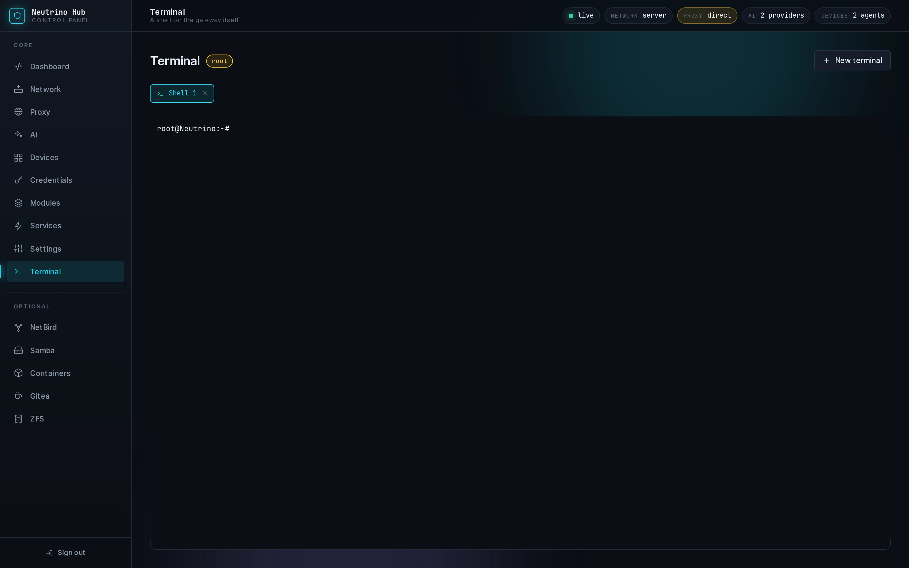
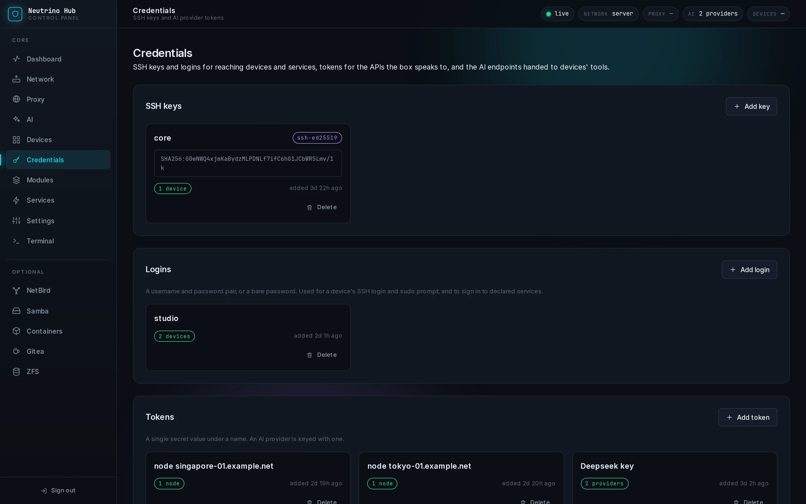
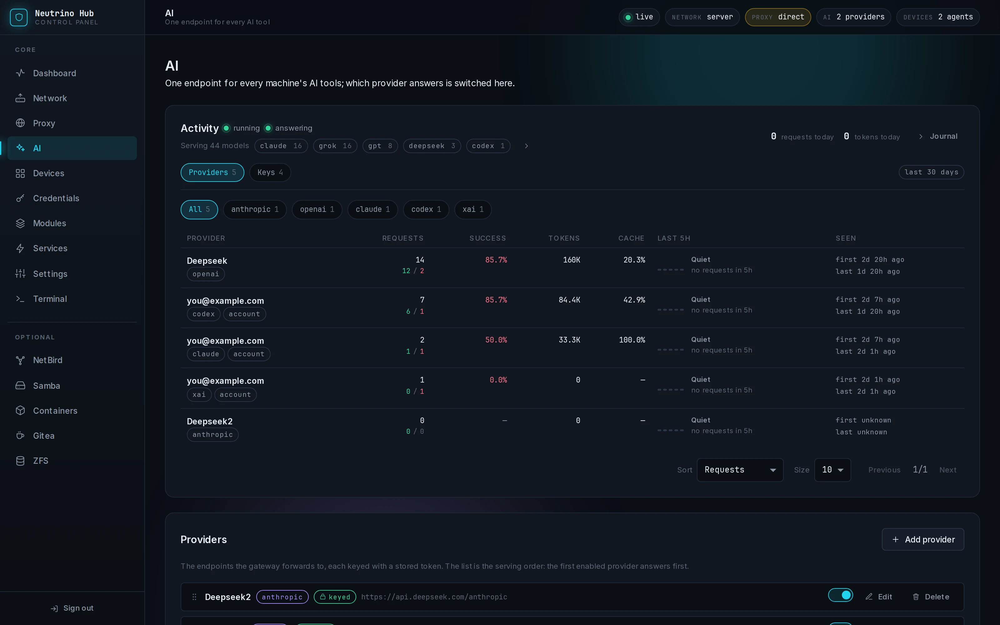
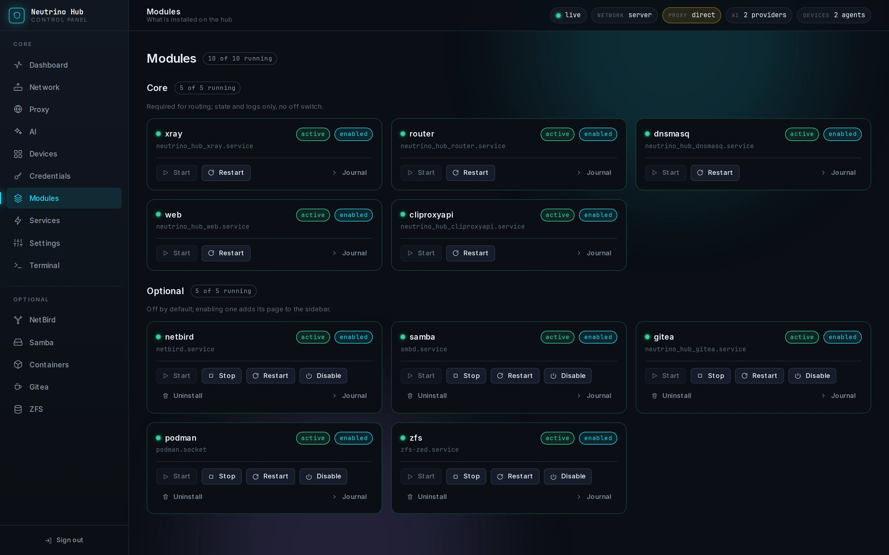
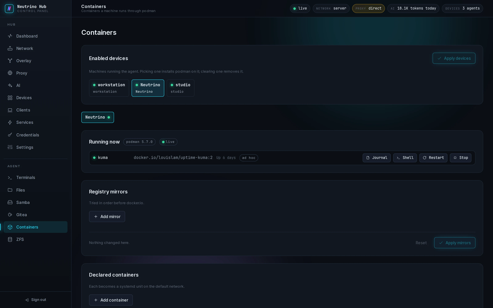
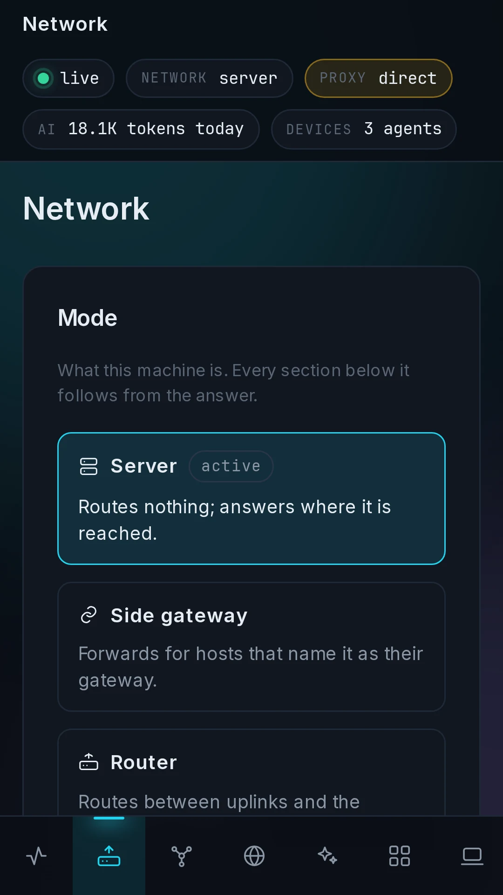

<div align="center">


# One box at home. Every machine you own inherits it.

**English** · [中文](README.zh-CN.md)

[](LICENSE)
[](https://github.com/iffiX/neutrino/releases)
[](#compatibility)
[](#compatibility)
[](#compatibility)

A neutrino passes through walls without touching them.<br/>
The wall is still there. It just stops being yours.

</div>

Neutrino is a self-hosted management tool for developers with several
machines. It runs on an always-on Linux server and provides a web panel for
proxy routing, remote access, an AI gateway, file sharing, and self-hosted
services.

The server runs the **Hub**. An **Agent** on each managed computer reports
system status and runs software installation tasks. From the Agent's window,
you can also mount shares, open services, and configure AI tools.
Neutrino configures existing software, including Xray, NetBird, CLIProxyAPI,
and Samba, with optional modules for storage and other services.

It is the control plane for a one-person homelab, written like something that
has root on the machines it manages, because it does.

A spare 64-bit Raspberry Pi is enough to get started.

[Features](#features) · [Install](#install) · [Access and permissions](#access-and-permissions) · [Documentation](#documentation)

<a href="images/screenshots/dashboard.webp"></a>

## What it actually is

Neutrino does not replace Xray, ZFS, Gitea or Samba. It is the layer that
configures them as one system, and makes their services available to the
other machines you own.

|                     |                                                                                                                                                                                                                                                                                          |
| ------------------- | ---------------------------------------------------------------------------------------------------------------------------------------------------------------------------------------------------------------------------------------------------------------------------------------- |
| **One config tree** | `config/` is the only source of truth. Every change is render, validate, apply; the panel and CLI share that path. Back up one directory to keep the Hub's configuration. Shared files and service data have their own backups.                                                          |
| **One panel**       | Network, proxy, AI, devices, credentials, storage, services. One visual language, not six dashboards sharing a login.                                                                                                                                                                    |
| **One agent**       | A machine joins with one link and gets the services you published: shares, ports, links, the AI endpoint, a remote desktop. Linux is supported; Windows and macOS are **under testing**.                                                                                                 |
| **One AI endpoint** | Your Claude subscription, your ChatGPT subscription and your API keys pooled behind one address. Each machine's Claude Code, Codex and Gemini CLI can point there. Keys are issued per device and local account, with usage metered on the Hub.                                          |
| **One way out**     | `nhub reset all` removes the Hub's firewall table and policy route and restarts the machine's own network manager. It keeps every interface address in place to preserve your SSH connection. It also clears your Hub configuration, so take a backup first. |

## Features

The Hub manages its host and communicates with Agents on other machines.
NetBird provides remote access to the Hub and the home network.


### Network and remote access

The Hub can run as a router, a side gateway, or a server. Router and gateway
modes manage traffic for other devices; server mode keeps the host's existing
network configuration.

Xray handles proxy nodes, load balancing, split routing, and DNS. Import nodes
from share links and choose which devices and destinations use the proxy.
Direct fallback when all proxy nodes fail is off by default. NetBird connects
remote machines to your home network through a WireGuard overlay.

<table>
<tr>
<td width="50%"><a href="images/screenshots/netbird.webp"></a></td>
<td width="50%"><a href="images/screenshots/proxy.webp"></a></td>
</tr>
<tr>
<td><b>NetBird:</b> peer topology and direct or relayed connections.</td>
<td><b>Proxy:</b> node latency, load balancing, and routing rules.</td>
</tr>
</table>

### Device management

Discover machines on the LAN, save their SSH credentials, and open a terminal
or SFTP browser from the panel. Devices running the Agent report CPU, memory,
disk, temperature, GPU, and process information. The panel also provides
Wake-on-LAN, power controls, and direct remote desktop access through RustDesk.

You can install tools such as an SSH server, cc-switch, and RustDesk on managed
devices. The Hub caches downloaded installers and supplies them to the Agent.
Installation runs when requested; manually installed software is also detected.

<details>
<summary>Hub terminal and credentials</summary>

<table>
<tr>
<td width="50%"><a href="images/screenshots/terminal.webp"></a></td>
<td width="50%"><a href="images/screenshots/credentials.webp"></a></td>
</tr>
<tr>
<td><b>Terminal:</b> a shell on the Hub itself.</td>
<td><b>Credentials:</b> stored SSH keys, logins, and API tokens.</td>
</tr>
</table>

</details>

### AI gateway

The Hub runs CLIProxyAPI. Connect subscription accounts such as Claude and
ChatGPT, or add API keys for providers using the Anthropic, OpenAI, or Gemini
protocol. These are available through one gateway address, with model aliases
and usage statistics by provider and client key.

On each computer, use the Agent to choose which local accounts' Claude Code,
Codex, or Gemini CLI should connect to the gateway. Access keys are issued
per device and local account. Deactivating an integration restores the tool's
saved configuration.

<table>
<tr>
<td width="50%"><a href="images/screenshots/ai.webp"></a></td>
<td width="50%"><a href="images/screenshots/ai_accounts.webp"></a></td>
</tr>
<tr>
<td><b>Usage:</b> requests, success rates, tokens, and cache usage.</td>
<td><b>Accounts:</b> upstream providers, subscriptions, and client keys.</td>
</tr>
</table>

### Storage and services

Optional modules manage ZFS pools and datasets, disk health, disk replacement,
and Samba shares. You can also run Gitea and Podman containers on the Hub.

The Hub publishes a service list to Agents: web pages to open, ports to
forward, and file shares to mount. The list can include services hosted
elsewhere on your network.

<details>
<summary>Modules, services, file shares, and containers</summary>

<table>
<tr>
<td width="50%"><a href="images/screenshots/modules.webp"></a></td>
<td width="50%"><a href="images/screenshots/services.webp"></a></td>
</tr>
<tr>
<td><b>Modules:</b> software installed on the Hub.</td>
<td><b>Services:</b> entries published to Agents.</td>
</tr>
<tr>
<td><a href="images/screenshots/samba.webp"></a></td>
<td><a href="images/screenshots/containers.webp"></a></td>
</tr>
<tr>
<td><b>Samba:</b> shares, users, and active sessions.</td>
<td><b>Containers:</b> Podman workloads and their status.</td>
</tr>
</table>

</details>

<details>
<summary>Mobile layout</summary>

The panel adapts to phone screens. Dashboard, proxy, AI, and network pages:

<p align="center">
<a href="images/screenshots/dashboard_portrait.webp"></a>
<a href="images/screenshots/proxy_portrait.webp"></a>
<a href="images/screenshots/ai_portrait.webp"></a>
<a href="images/screenshots/network_portrait.webp"></a>
</p>

</details>

## Install

### Compatibility

| Component | Platforms                                                                     | Architectures |
| --------- | ----------------------------------------------------------------------------- | ------------- |
| Hub       | Linux with systemd and glibc 2.34 or newer; `.deb`, `.rpm`, and Arch packages | x86-64, ARM64 |
| Agent     | Linux; Windows and macOS **under testing**                                    | x86-64, ARM64 |

Both packages include their own Python runtime. The Hub also includes Xray
and CLIProxyAPI. System dependencies are installed by the package manager.

A 64-bit Raspberry Pi with 1 GB of RAM can run the core services with optional
modules off. Memory requirements increase with modules and workloads.

### Hub

Download the package for your system from
[Releases](https://github.com/iffiX/neutrino/releases). On Debian or Ubuntu,
install it and run setup. Replace `<version>` with the downloaded version;
the example uses x86-64 (`amd64`).

```bash
sudo apt install "./neutrino-hub_<version>_amd64.deb"
sudo nhub setup
```

Complete the wizard in the terminal or a browser, then open
`http://<hub-address>:8080`. Choose `server` mode to use the Hub without
changing the host's network configuration.

### Agent

Install the Agent package on each computer you want to manage. Copy an
enrollment link from the Hub's **Devices** page and paste it into the Agent
window. On Debian or Ubuntu, you can also connect from the command line:

```bash
sudo apt install "./neutrino-agent_<version>_amd64.deb"
sudo nagent connect 'neutrino://enroll/...'
```

Replace the link with the one from your panel. Windows and macOS Agents are
**under testing**; their native installers are available from Releases.
For Linux machines reachable over SSH, the Devices page can install and
enroll the Agent remotely.

## Access and permissions

Neutrino is intended for one person managing their own machines. The panel
uses a single password and has no separate user roles. There is no high
availability deployment; services hosted by the Hub stop when it is offline.

The Hub runs as root. The Agent service also needs administrator privileges
to install software and manage its machine. Access the panel through a
trusted LAN or NetBird; the panel itself uses HTTP and should not be exposed
to the public Internet.


The channel between Hub and Agent uses TLS with a certificate fingerprint
carried in the enrollment link. Links expire after five minutes and are
consumed atomically: two machines racing the same link cannot both join.
Credentials in the Hub's vault are encrypted; restoring them requires the
master passphrase chosen during setup.

The vault file does not even say what it holds. Names, types, and secret
values are encrypted together, and the unwrapped key stays outside the
configuration backup.

## Configuration and backups

Hub settings live in `config/`. The panel and `nhub apply` use the same
render, validate, and apply pipeline.

The Settings page exports a configuration backup. Keep the vault's master
passphrase for restoration, and back up shared files, Git repositories, and
container data separately. AI subscription accounts need to be signed in
again after a restore.

Restore configuration backups from the Settings page using the vault's
master passphrase. Reset and vault commands are in the
[command reference](docs/cli.md).

## Why I built it

Neutrino started as a tool for my own workstation, laptop, and small machines
at home. I use it for my development environment.

<table>
<tr valign="top">
<td width="50%" align="center">

<p><b>Reaching the tools was the first problem.</b></p>
<p align="left">A repository would not clone, a package would not download, an AI service refused the connection. I wanted to fix the route once, on the Hub.</p>
</td>
<td width="50%" align="center">

<p><b>I go travelling. The workstation does not.</b></p>
<p align="left">My files and services stayed at home, and I needed a way back in. With NetBird and the web panel, I can reach them from a laptop or a phone.</p>
</td>
</tr>
<tr valign="top">
<td align="center">

<p><b>No machine of mine is difficult. All of them together are.</b></p>
<p align="left">A workstation, a laptop, a GPU box, a Pi: each has its own address, login, and problems. I wanted them on one page where I could see what was running and open a terminal.</p>
</td>
<td align="center">

<p><b>Data grows quietly.</b></p>
<p align="left">Drives arrived one at a time, until remembering where everything lived became a chore. Now I keep the pool and shares on the Hub, and mount them where I need them.</p>
</td>
</tr>
<tr valign="top">
<td align="center">

<p><b>Everything worked. Each thing lived somewhere else.</b></p>
<p align="left">Gitea here, a container there, SSH on another port. Publishing those services from the Hub gives me the same list on every machine.</p>
</td>
<td align="center">

<p><b>I was tired of copying the same keys around.</b></p>
<p align="left">Every new machine meant setting up the same AI providers and tools again. Now I add those accounts once on the Hub and connect my tools to its gateway.</p>
</td>
</tr>
</table>

Neutrino is at 0.1 and is maintained by one person. The repository includes
VM integration tests for Debian, Ubuntu, Fedora, and Arch, plus Agent testing
on Linux, Windows, and macOS. Report problems through
[Issues](https://github.com/iffiX/neutrino/issues), including your OS, version,
and the steps that failed.

## Documentation

- [Command reference](docs/cli.md)
- [Agent installation and commands](agent/README.md)

## Acknowledgements

Neutrino builds on these projects:

- [Xray-core](https://github.com/XTLS/Xray-core): proxy routing.
- [CLIProxyAPI](https://github.com/router-for-me/CLIProxyAPI): AI gateway.
- [cpa-usage-keeper](https://github.com/Willxup/cpa-usage-keeper): reference for the AI usage screens.
- [NetBird](https://netbird.io): remote access over WireGuard.
- [cc-switch](https://github.com/SaladDay/cc-switch-cli): AI tool configuration.
- [RustDesk](https://rustdesk.com): remote desktop.
- [Gitea](https://about.gitea.com): Git hosting.
- [Samba](https://www.samba.org): file sharing.
- [Podman](https://podman.io): containers.
- [OpenZFS](https://openzfs.org): storage.
- [dnsmasq](https://thekelleys.org.uk/dnsmasq/doc.html): LAN DHCP and DNS.
- [hostapd](https://w1.fi/hostapd/): Wi-Fi access point.
- [v2fly geodata](https://github.com/v2fly): routing databases.

Claude Code and ChatGPT assisted with implementation, debugging, design, and
documentation. The author reviews and maintains the released work.

## License

[MIT](LICENSE).

<div align="center">


# Let creation be fun again.

Spend less time maintaining the environment.<br/>
Spend more of it on whatever made you build one in the first place.

</div>
