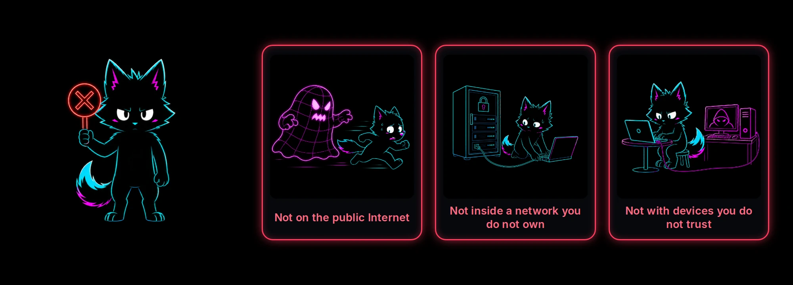
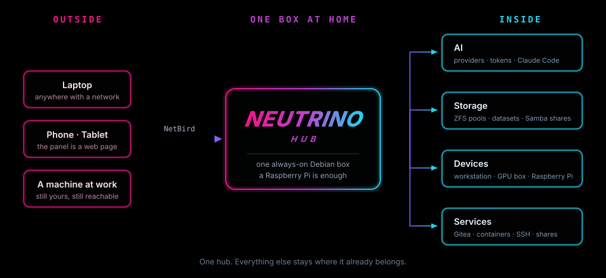

<div align="center">


# One box at home. Every machine you own inherits it.

**English** · [中文](README.zh-CN.md)

[](LICENSE)
[](https://github.com/iffiX/neutrino/releases)
[](#what-runs-where)
[](#what-runs-where)
[](#what-runs-where)

A neutrino passes through walls without touching them.<br/>
The wall is still there. It just stops being yours.

**[Install](#install)** · **[Documentation](https://neutrino.beyond-infinity.top/)** · [What it does](#what-it-does) · [Panel](#the-panel) · [Why](#why-i-built-it)

</div>

## What it does

In one line: the hub manages your machines and publishes the services they provide; a client on your LAN, or one that reaches the hub from outside through the overlay, gets the same services.

Each part has its place. The hub runs on one always-on Linux box and handles the network, the overlay, the proxy and the AI gateway. The agent runs on every Linux machine you manage and provides that machine's shares, git server, containers, storage and desktop. The client runs on every computer you sit at and turns those services into buttons in a window.

| What you can do                                                                                                           | Where           |
| ------------------------------------------------------------------------------------------------------------------------- | --------------- |
| Pick the box's shape (server, side gateway, router), give each interface a role, choose the networks the panel listens on | **Network**     |
| Join a NetBird network or create an EasyTier one, and reach the LAN through the box from outside                          | **Overlay**     |
| Import exit nodes from `ss://` and `vless://` links, open SOCKS ports, split traffic by device and destination            | **Proxy**       |
| Put API providers and subscription accounts behind one endpoint, with a key per client                                    | **AI**          |
| Enroll a machine by link or over SSH, read its vitals, reboot or wake it, open its shared desktop                         | **Devices**     |
| Make a link for a person's computer, then enable, disable or delete that client                                           | **Clients**     |
| Read what is published, and declare a web address, a TCP port or an SMB share by hand                                     | **Services**    |
| Store SSH keys, logins and tokens once, sealed in the vault, for the pages that sign in with them                         | **Credentials** |
| Change the password and language, download or restore a backup, read the three versions                                   | **Settings**    |

<a href="images/web/one_click.webp"></a>

## Supported platforms

| Hub             | Versions                                                                                 | Architectures | Package        |
| --------------- | ---------------------------------------------------------------------------------------- | ------------- | -------------- |
| Debian family   | Debian 12 and newer, Ubuntu 24.04 and newer, Raspberry Pi OS 64-bit (bookworm and newer) | x86-64, ARM64 | `.deb`         |
| Fedora and RHEL | Fedora 41 and newer; RHEL 9 family (AlmaLinux, Rocky) with EPEL                          | x86-64, ARM64 | `.rpm`         |
| Arch family     | Arch, EndeavourOS, Manjaro                                                               | x86-64        | `.pkg.tar.zst` |

| Agent           | Versions                                                            | Architectures | Package |
| --------------- | ------------------------------------------------------------------- | ------------- | ------- |
| Debian family   | Debian 12 and newer, Ubuntu 24.04 and newer, Raspberry Pi OS 64-bit | x86-64, ARM64 | `.deb`  |
| Fedora and RHEL | Fedora 41 and newer; RHEL 9 family                                  | x86-64, ARM64 | `.rpm`  |

| Client          | Versions                                                            | Architectures | Package |
| --------------- | ------------------------------------------------------------------- | ------------- | ------- |
| Debian family   | Debian 12 and newer, Ubuntu 24.04 and newer, with a desktop session | x86-64, ARM64 | `.deb`  |
| Fedora and RHEL | Fedora 41 and newer; RHEL 9 family, with a desktop session          | x86-64, ARM64 | `.rpm`  |
| Windows         | Windows 10 and 11                                                   | x86-64        | `.msi`  |
| macOS           | Apple silicon                                                       | ARM64         | `.pkg`  |

## Install

<details><summary><b>Hub · Debian, Ubuntu, Raspberry Pi OS</b></summary>

```bash
sudo apt install ./neutrino-hub_0.2.0_amd64.deb
sudo nhub setup
```

`nhub setup` opens a six-screen wizard in your browser. When it finishes, the panel is at `http://<hub>:8080`, where `<hub>` is the box's address.
</details>
<details><summary><b>Hub · Fedora, RHEL, AlmaLinux, Rocky</b></summary>

```bash
sudo dnf install ./neutrino-hub-0.2.0-1.x86_64.rpm
sudo nhub setup
```

On RHEL, AlmaLinux and Rocky, run `sudo dnf install -y epel-release` first: fail2ban, arp-scan and vnstat come from EPEL. The wizard then runs as it does on Debian, and the panel is at `http://<hub>:8080`.
</details>
<details><summary><b>Hub · Arch, EndeavourOS, Manjaro</b></summary>

```bash
sudo pacman -U neutrino-hub-0.2.0-1-x86_64.pkg.tar.zst
sudo nhub setup
```

Setup runs the same six-screen wizard, and the panel is at `http://<hub>:8080` afterwards.
</details>
<details><summary><b>Agent · Debian, Ubuntu, Raspberry Pi OS, Fedora, RHEL</b></summary>

```bash
sudo apt install ./neutrino-agent_0.2.0_amd64.deb      # Debian family
sudo dnf install ./neutrino-agent-0.2.0-1.x86_64.rpm   # Fedora family
sudo nagent connect '<link>'
```

`<link>` is what **Add by link** on the **Devices** page shows; it is valid for five minutes, and the machine then appears under **Managed devices**.
</details>
<details><summary><b>Client · Debian, Ubuntu, Fedora, RHEL</b></summary>

```bash
sudo apt install ./neutrino-client_0.2.0_amd64.deb      # Debian family
sudo dnf install ./neutrino-client-0.2.0-1.x86_64.rpm   # Fedora family
nclient gui
```

Run the client from your own account, then paste the link from the **Clients** page into the window.
</details>
<details><summary><b>Client · Windows 10 and 11, macOS on Apple silicon</b></summary>

```bash
msiexec /i neutrino-client-0.2.0-windows-amd64.msi                    # Windows
sudo installer -pkg neutrino-client-0.2.0-macos-arm64.pkg -target /  # macOS
```

Opening the `.msi` from Explorer, or the `.pkg` from its context menu with **Open**, runs the same installer. The Windows installer offers to put `nclient` on `PATH`. The client then sits in the taskbar corner on Windows or in the menu bar on macOS.
</details>

Every file is on the [releases page](https://github.com/iffiX/neutrino/releases), and the site's install pages have the screenshots: [the hub](https://neutrino.beyond-infinity.top/hub/install.html), [the agent](https://neutrino.beyond-infinity.top/agent/install.html) and [the client](https://neutrino.beyond-infinity.top/client/install.html).

## Documentation

[Quick start](https://neutrino.beyond-infinity.top/quick-start.html) · [Overview](https://neutrino.beyond-infinity.top/overview.html) · [Troubleshooting](https://neutrino.beyond-infinity.top/reference/troubleshooting.html)

## The services

| Client panel    | What the hub publishes         | Where the entry comes from                        | The button            |
| --------------- | ------------------------------ | ------------------------------------------------- | --------------------- |
| Web             | a link                         | the Gitea module, or declared by hand             | **Open**              |
| Ports           | a TCP port                     | a container's published port, or declared by hand | **Connect**           |
| AI              | the gateway endpoint and a key | the AI gateway on the hub                         | **Config**, **Apply** |
| Files           | an SMB share                   | the Samba module, or declared by hand             | **Config**, **Mount** |
| Remote desktops | a desktop the machine shares   | `sudo nagent rdp start` on that machine           | **Connect**           |

<table>
<tr valign="top">
<td width="33%"></td>
<td width="33%"></td>
<td width="33%"></td>
</tr>
<tr valign="top">
<td></td>
<td></td>
<td></td>
</tr>
</table>

## The panel

<table>
<tr valign="top">
<td width="50%"><a href="images/screenshots/dashboard.webp"></a><p><b>Dashboard</b>: throughput, active exits and DNS queries.</p></td>
<td width="50%"><a href="images/screenshots/proxy.webp"></a><p><b>Proxy</b>: exit nodes and split routing.</p></td>
</tr>
<tr valign="top">
<td><a href="images/screenshots/ai_accounts.webp"></a><p><b>AI</b>: providers, accounts and keys.</p></td>
<td><a href="images/screenshots/devices.webp"></a><p><b>Devices</b>: managed and unmanaged machines.</p></td>
</tr>
<tr valign="top">
<td><a href="images/screenshots/services.webp"></a><p><b>Services</b>: the four published groups.</p></td>
<td><a href="images/screenshots/samba.webp"></a><p><b>Samba</b>: shares, users and sessions on one machine.</p></td>
</tr>
</table>

<p align="center">   </p>

## What runs where

| Package           | Runs on                             | Runs as                            | Does                                                                                           |
| ----------------- | ----------------------------------- | ---------------------------------- | ---------------------------------------------------------------------------------------------- |
| `neutrino-hub`    | one Linux box, x86-64 or ARM64      | root, the panel and its units      | the router (xray, nftables, dnsmasq), the AI gateway, the overlay, devices, clients, the vault |
| `neutrino-agent`  | every Linux machine the hub manages | root, headless, listens on nothing | Samba, Gitea, Podman, ZFS and the RustDesk host on that machine                                |
| `neutrino-client` | Linux, Windows and macOS            | a person's session                 | the tray and the window: open, forward, mount, view a desktop, switch the AI tools             |

The three packages share one version number, and the panel marks an agent or a client on another version for upgrade. The hub's own machine runs an agent too, as one device among the others. Every module runs under an agent on the machine that has the disk or the GPU, so the hub box stays small.

## Security



- The hub and the agent run as root; the client runs as the person, and its one privileged step is a polkit helper that mounts a share.
- The panel is plain HTTP, for the LAN and the overlay: the password is not protected from someone reading the wire, so keep the panel on a network you own. It is protected from guessing: five free attempts, then each failure locks login for 30 s, 60 s, 5 min, an hour, a day; and fail2ban bans an address that hammers SSH on the same ladder.
- Everything between the hub and its agents and clients is TLS. An enrollment link is valid for five minutes and is consumed once, and the channel pins the hub's certificate by the fingerprint inside that link, so a machine that joined speaks only to the hub it joined.
- The vault is sealed under the passphrase set during setup.

## Why I built it

<table>
<tr valign="top">
<td width="50%" align="center"><p><b>Reaching the tools was the first problem.</b></p></td>
<td width="50%" align="center"><p><b>I go travelling. The workstation does not.</b></p></td>
</tr>
<tr valign="top">
<td align="center"><p><b>No machine of mine is difficult. All of them together are.</b></p></td>
<td align="center"><p><b>Data grows quietly.</b></p></td>
</tr>
<tr valign="top">
<td align="center"><p><b>Everything worked. Each thing lived somewhere else.</b></p></td>
<td align="center"><p><b>I was tired of copying the same keys around.</b></p></td>
</tr>
</table>

<details><summary><b>Architecture and development</b></summary>



| Component | Parts                                                                                                                                                                |
| --------- | -------------------------------------------------------------------------------------------------------------------------------------------------------------------- |
| Hub       | router (xray, nftables, dnsmasq) · AI gateway (CLIProxyAPI, a key per client, metering) · overlay (NetBird, EasyTier) · panel (FastAPI, React, `/ws/events`) · vault |
| Agent     | samba · gitea · podman · zfs · RustDesk host · terminal and file streams                                                                                             |
| Client    | tray and window · port forwarder · mount helper · cc-switch · RustDesk viewer                                                                                        |

```bash
pip install -e "hub[dev]" && pip install -e agent && pip install -e client
black --check hub agent client
cd hub && pytest -q
cd hub/frontend && npm run build
nhub apply --dry-run
```

Python 3.12 or newer, Node 24 or newer, black and pytest; `hub/`, `agent/` and `client/` are the three packages, `config/` the source of truth at runtime, `docs/` the site and `packaging/` the VM rig. The contributor standard is [AGENTS.md](AGENTS.md).
</details>

## Acknowledgements

Neutrino configures and includes work by others:

- [Xray-core](https://github.com/XTLS/Xray-core), the proxy core behind the Proxy page
- [CLIProxyAPI](https://github.com/router-for-me/CLIProxyAPI), the AI gateway
- [cpa-usage-keeper](https://github.com/Willxup/cpa-usage-keeper), the usage metering beside it
- [NetBird](https://netbird.io), one of the two overlay engines
- [EasyTier](https://github.com/EasyTier/EasyTier), the other overlay engine
- [cc-switch](https://github.com/SaladDay/cc-switch-cli), which points the AI tools at the gateway
- [RustDesk](https://rustdesk.com), the remote desktop host and viewer
- [Gitea](https://about.gitea.com), the git server a machine hosts
- [Samba](https://www.samba.org), the SMB server a machine hosts
- [Podman](https://podman.io), the container runtime a machine hosts
- [OpenZFS](https://openzfs.org), the pools and datasets a machine hosts
- [dnsmasq](https://thekelleys.org.uk/dnsmasq/doc.html), DHCP and DNS on the served networks
- [hostapd](https://w1.fi/hostapd/), the access point on a wireless LAN
- [v2fly geodata](https://github.com/v2fly), the direct lists for split routing

Claude Code and ChatGPT assisted with implementation, debugging, design and documentation; the author reviews every release.

## License

[MIT](LICENSE).

<div align="center">


# Let creation be fun again.

Spend less time maintaining the environment.<br/>
Spend more of it on whatever made you build one in the first place.

</div>
