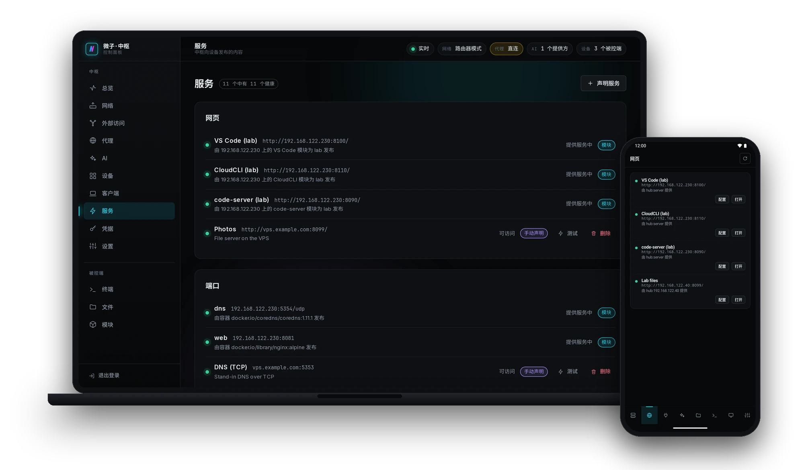
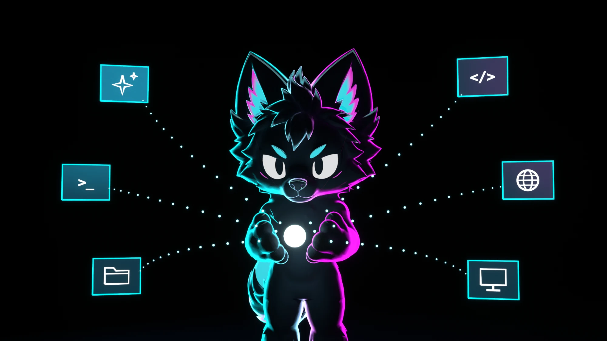

<div align="center">


# Your home machines. One scan. From anywhere.

A small tool I made so I could travel.

**English** · [中文](README.zh-CN.md)

[](LICENSE)
[](https://github.com/iffiX/neutrino/releases)
[](https://gitee.com/iffiX/neutrino/releases)
[](https://neutrino.beyond-infinity.top/reference/platforms.html)

[](https://github.com/iffiX/neutrino/actions/workflows/ci.yml)
[](https://github.com/iffiX/neutrino/actions/workflows/release.yml)
[](https://github.com/iffiX/neutrino/actions/workflows/ci.yml)
[](https://github.com/iffiX/neutrino)

**[Install](#install)** · **[Documentation](https://neutrino.beyond-infinity.top/)** · [Releases](https://github.com/iffiX/neutrino/releases)

</div>



## What it does

- **AI sessions**: CloudCLI on a machine at home, picked up on your phone.
- **Editors**: VS Code and code-server, opened in the browser.
- **Terminals**: kept and shared, the same session on several devices.
- **Remote desktop**: one tap.
- **Files**: mounted as a drive letter or a folder.
- **Ports**: a container's published port, or any TCP or UDP port you declare, forwarded to your machine.

Everything goes through one port on the hub, at home or away. The AI gateway takes your accounts once and gives every device the same setup.



## Install

The computer you want to reach gets one package, the phone gets the app, one scan and you are in. Pick your system:

<p align="center">
<a href="https://github.com/iffiX/neutrino/releases/latest"></a>
<a href="https://github.com/iffiX/neutrino/releases/latest"></a>
<a href="https://github.com/iffiX/neutrino/releases/latest"></a>
<a href="https://github.com/iffiX/neutrino/releases/latest"></a>
</p>

Once the computer has it, search for **Neutrino Hub** and open it, the same on all three systems, and follow the wizard in your browser. A few minutes, a password, and the panel is up.

On a machine with no desktop, an ARM64 router box, a dev board, or a computer you reach over SSH, start the wizard in the terminal: answer it there, or open the address it prints from another computer. Linux and macOS:

```bash
sudo nhub setup
```

Windows, in an administrator PowerShell:

```powershell
nhub setup
```

If you would rather not click around, one command downloads, verifies and installs, and goes straight into the wizard. Linux and macOS:

```bash
curl -fsSL https://github.com/iffiX/neutrino/releases/latest/download/install.sh | sh
```

Windows:

```powershell
irm https://github.com/iffiX/neutrino/releases/latest/download/install.ps1 | iex
```

The mainland edition downloads from [Gitee](https://gitee.com/iffiX/neutrino/releases) and installs the same way. More machines, or the client on another computer: see [Install](https://neutrino.beyond-infinity.top/install/hub.html) in the docs.

## Join with one scan

Make a link on the panel's Clients page. A phone scans it, a computer pastes it, and the services are in the list.

## Reach it from outside

NetBird, EasyTier, a VPS of your own, or Direct\*: turn one on in the panel's Access page. NetBird or EasyTier is the recommended way. What each needs is on [Access](https://neutrino.beyond-infinity.top/hub/overlay.html).

\* Direct opens 8443 to the public internet. Its security is still being tested, so keep it off the public internet for now.

## Uninstall

To start over without uninstalling, reset the hub. The package stays, and `sudo nhub setup` sets it up again:

```bash
sudo nhub reset all
```

**Remove the hub.** Removing the package stops its services and gives the computer its network back; nothing has to be reset first. The configuration and the keys stay for a later install:

```bash
sudo apt remove neutrino-hub     # Debian, Ubuntu
sudo dnf remove neutrino-hub     # Fedora, RHEL
sudo pacman -R neutrino-hub      # Arch
```

On Windows, uninstall **Neutrino Hub** under **Settings** > **Apps** > **Installed apps**.

**Remove the client.** Leave the hub in the client first (**Leave** on the hub's row, or `nclient leave --yes`), then:

```bash
sudo apt remove neutrino-client    # Debian, Ubuntu; purge also deletes every account's configuration
sudo dnf remove neutrino-client    # Fedora, RHEL
```

On Windows, uninstall **Neutrino Client** under **Installed apps**; on a phone, uninstall the app.

<details>
<summary><b>Remove hub configuration too</b></summary>

To leave nothing of the hub behind, the keys and the vault included:

```bash
sudo apt purge neutrino-hub                                                  # Debian, Ubuntu
sudo rm -rf /etc/neutrino/hub /var/lib/neutrino/hub /var/log/neutrino/hub    # Fedora, RHEL, Arch, after the removal
```

On Windows, delete `C:\ProgramData\Neutrino\hub` after the uninstall.

</details>

<details>
<summary><b>Remove the agent</b></summary>

On a managed machine, removing the agent's package takes away what its modules added, their services, scheduled tasks and firewall rules; shares, repositories and container volumes stay:

```bash
sudo apt remove neutrino-agent     # Debian, Ubuntu; purge also deletes its configuration
sudo dnf remove neutrino-agent     # Fedora, RHEL
sudo nagent service uninstall      # macOS, or any system: only what the modules added, the package stays
```

On Windows, uninstall **Neutrino Agent** under **Installed apps**.

</details>

The macOS commands and what each step keeps are on the docs site's [Uninstall](https://neutrino.beyond-infinity.top/uninstall.html) page.

## Security

- **One port faces the outside.** Only 8443, and only while Direct\* is on; the panel's two ports answer only on the networks you tick. From outside, all anyone sees is one TLS port that asks for a ticket.
- **Only a device that joined can connect, and every connection is encrypted.** A client or an agent reaches the hub over TLS only. Joining takes the ticket in a link that lives thirty minutes and works once; the device then pins the hub's certificate and talks to that hub alone.
- **Basic protection against DoS.** An unverified peer gets one handshake, under caps on connections, handshake time and message size; past a cap it is cut off. This part is still young, and issues are welcome.
- **The panel password resists guessing.** After five failed attempts the login locks, and each further failure lengthens the lock: 30 s, 60 s, 5 min, an hour, a day. fail2ban bans an address that keeps failing SSH logins, on the same ladder.
- **Keys stay sealed in a vault.** Keys, passwords and tokens are encrypted under the passphrase you set at setup; config files and backups carry only ciphertext, and the panel does not show them again once stored.
- **Root stays where it is needed.** The hub rewrites the firewall and installs packages, the agent starts services, so both run as root with the unit stripped of what root does not need; the client runs as you.

The details are in [design/connection.md](skills/core-code-author/design/connection.md) and [design/privilege.md](skills/core-code-author/design/privilege.md). The reader's version is the docs site's [Security](https://neutrino.beyond-infinity.top/security.html) page.

## Documentation and license

[Documentation](https://neutrino.beyond-infinity.top/) · [中文文档](https://neutrino.beyond-infinity.top/zh-CN/)

[MIT](LICENSE). The Android app under `client/android/` compiles in the RustDesk core, so that directory is AGPL-3.0 by the `LICENSE` inside it.

## Community

Where this project is announced and discussed:

- [V2EX](https://www.v2ex.com/t/1241622), in the 分享创造 node
- [LINUX DO](https://linux.do), in the 开发调优 board

## Acknowledgements

- [Xray-core](https://github.com/XTLS/Xray-core), the proxy core
- [CLIProxyAPI](https://github.com/router-for-me/CLIProxyAPI), the AI gateway
- [cpa-usage-keeper](https://github.com/Willxup/cpa-usage-keeper), the usage metering beside it
- [NetBird](https://github.com/netbirdio/netbird), the overlay with a management plane
- [EasyTier](https://github.com/EasyTier/EasyTier), the decentralised overlay
- [cc-switch](https://github.com/SaladDay/cc-switch-cli), which points Claude Code, Codex and Gemini CLI at the gateway
- [RustDesk](https://github.com/rustdesk/rustdesk), the remote desktop host and viewer
- [CloudCLI](https://github.com/siteboon/claudecodeui), AI coding sessions in the browser
- [code-server](https://github.com/coder/code-server), VS Code in the browser
- [Gitea](https://github.com/go-gitea/gitea), the private git server
- [Samba](https://www.samba.org/), the SMB shares
- [Podman](https://github.com/containers/podman), the container runtime
- [OpenZFS](https://github.com/openzfs/zfs), the pools and datasets
- [dnsmasq](https://thekelleys.org.uk/dnsmasq/doc.html), DHCP and DNS on the served networks
- [hostapd](https://w1.fi/hostapd/), the wireless access point
- [v2fly geodata](https://github.com/v2fly/domain-list-community), the lists for split routing

<div align="center">


# Let creation be fun again.

Spend less time maintaining the environment.<br/>
Spend more of it on whatever made you build one in the first place.

</div>
