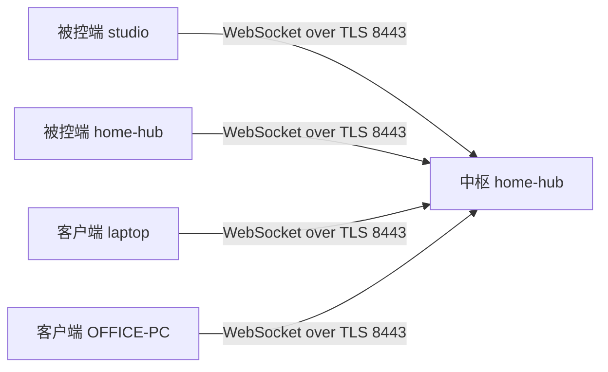

# 总览

微子由三个包组成：中枢 `neutrino-hub`、被控端 `neutrino-agent`、客户端 `neutrino-client`。这一页讲的是它们各自落在哪台机器上，以及通道朝哪个方向开。要找命令的同学请直接看[《命令行》](./cli.md)。

中枢只跑 Linux，x86-64 或者 ARM64。被控端也只有 Linux 版，没有 Windows 版，也没有 macOS 版，而且它没有窗口，也没有 `gui` 这个子命令。客户端跑 Linux 和 Windows，macOS 会被按名字拒绝。面板走 HTTP，HTTPS 还没做。离线的机器不能改，面板会直接拒绝，不会替你排队等它上线。

## 三个包

| 包                | 平台                | 身份                         | 干什么                                                                     |
| ----------------- | ------------------- | ---------------------------- | -------------------------------------------------------------------------- |
| `neutrino-hub`    | Linux x86-64、ARM64 | root，面板加若干单元         | 路由（xray、nftables、dnsmasq）、AI 网关、虚拟网、发现、中转、客户端、凭据 |
| `neutrino-agent`  | 只有 Linux          | root，无窗口，不监听任何端口 | 在一台机器上承载 Samba、Gitea、Podman、ZFS 和 RustDesk 主机，中枢那台也算  |
| `neutrino-client` | Linux、Windows      | 登录用户，从不是 root        | 挂共享、开服务、转端口、连远程桌面、把这台机器的 AI 工具切到网关           |

- 中枢自己不承载任何模块，所以那台机器可以很小：一块刷好的电视盒子或者树莓派就够。
- 拿着磁盘、显卡或者桌面的机器，都给它装一个被控端；中枢自己那台在初始化最后也被装上了。
- 每个包自带解释器，不用机器上的 Python；它们携带的每个二进制都在各自模块的 `constants.py` 里按版本和 sha256 钉死。

## 一个中枢、若干被控端、若干客户端

- **通道方向**：被控端向中枢开一条 WebSocket 并一直保持，TLS 由接入链接里的指纹钉住；期望状态、shell、文件、命令、上报和操作流全都复用这一条。
- **中枢从不拨号**：SSH 只在装被控端或者重装被控端的时候用一次。
- **在线只在内存里**：在线与否、版本号、最后一次出现的时间都在会话登记里，套接字的任何状态都不会写进 `config/`。
- **期望状态**：中枢按 `config/` 给每台设备组出一份文档，被控端自己留一份，连上来时比一遍，只应用不一样的部分。
- **离线不排队**：改一台离线机器的模块会被拒绝，界面上的话是「被控端已离线。」

`config/<module>/*.json` 是运行时唯一的事实源。每一次改动都是先写它，再渲染、校验、应用；面板和 `nhub apply` 走的是同一条流水线，没有任何东西去手改 `/etc`。

## 面板的两组

左边的导航分成两组。Hub 这一组是中枢这台机器本身，被控端那一组是中枢驱动的、装了被控端的机器，包括中枢自己那台。

| 页面   | 这一页做什么                |
| ------ | --------------------------- |
| 总览   | 实时吞吐、出口和 DNS        |
| 网络   | 接口角色、上行和 DHCP       |
| 虚拟网 | 远程访问这台网关            |
| 代理   | 出口节点、分流和 DNS        |
| AI     | 所有 AI 工具共用一个端点    |
| 设备   | 局域网主机和远程操作        |
| 客户端 | 以客户端身份连接 hub 的机器 |
| 服务   | hub 向设备发布的内容        |
| 凭据   | SSH 密钥和 AI 提供方令牌    |
| 设置   | 密码、备份和版本            |

| 被控端页面 | 这一页做什么               |
| ---------- | -------------------------- |
| 终端       | 已管理机器上的 shell       |
| 文件       | 浏览和搬运机器上的文件     |
| Samba      | 机器通过 SMB 提供的共享    |
| Gitea      | 私有 git 服务器            |
| 容器       | 机器通过 podman 运行的容器 |
| ZFS        | 存储池、数据集和磁盘健康   |

- 每一组设置底下只有一条应用栏，保存和应用是同一个动作。
- 面板自己的 `/ws/events` 负责让页面上的缓存失效，除了直接读某个守护进程状态的表格，没有东西在轮询。
- 后端的每一次拒绝都是一个代码加参数，不是一句英文；话在前端的文案表里，所以面板和客户端都说英文和简体中文。

## 从外面连回家

同一时间只有一张虚拟网：不开、NetBird，或者 EasyTier。这一项就是 `config/router/network.json` 里的虚拟网那一行，防火墙也读它。两个引擎都跑在中枢自己的单元下，二进制在 `/opt/neutrino/bin`。

两个引擎各自怎么用，见[《用 NetBird 组网》](./overlay-netbird.md)和[《用 EasyTier 组网》](./overlay-easytier.md)。这台机器是否在虚拟网上应答，由「网络」页的「开放范围」决定。

## 版本

三个包共用一个版本号。对不上时只会要求升级，不做协商，也没有迁移。

- 客户端比中枢新时，客户端上的话是「此客户端（{client_version}）比 hub（{hub_version}）新，请先升级 hub」。
- 被控端版本对不上时，设备抽屉里写「这个被控端与 hub 的版本不一致。」

升级的顺序是先中枢，再被控端，最后客户端，做法见[《升级与重置》](./upgrade-reset.md)。

